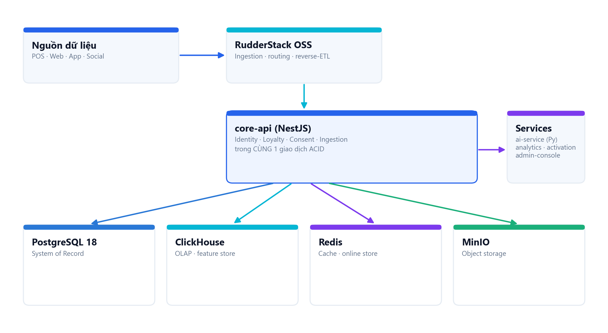

# 1. Kiến trúc & Công nghệ

## 1.1. Sơ đồ tổng thể



```
Nguồn dữ liệu (POS · Web · App · Social)
        │
        ▼
RudderStack OSS  ── ingestion · routing · reverse-ETL
        │
        ▼
core-api (NestJS)  ── Identity · Loyalty · Consent · Ingestion  (CÙNG 1 giao dịch ACID)
        │                                     │
        │ (fire-and-forget project)           ▼
        ▼                             ai-service (Py) · analytics · activation · admin-console
PostgreSQL 18 (SoR) ─ ClickHouse (OLAP) ─ Redis (cache/online) ─ MinIO (object)
```

## 1.2. Nguyên tắc kiến trúc

- **Transaction boundary ACID (bắt buộc):** `core-api` gom **identity + loyalty + consent + ingestion** trong CÙNG một transaction PostgreSQL. Lý do: tại POS phải **đúng tiền · đúng danh tính** — không cho phép trạng thái nửa vời (ghi giao dịch nhưng chưa resolve định danh, cộng điểm nhưng chưa ghi consent…). Các service không thuộc correctness lõi (analytics, ai-service, activation-orchestrator, admin-console) **tách riêng**.
- **Modular monolith (GĐ1):** một tiến trình `core-api` với các module rõ ràng (bounded context) thay vì microservice sớm. Tách microservice khi có nhu cầu scale thật; ~18 bounded context trong blueprint.
- **Dual-flow:**
  - *Operational realtime* — POS/ingest ghi thẳng PostgreSQL (SoR), phục vụ correctness + lookup tức thời.
  - *Warehouse micro-batch* — projection sang ClickHouse (OLAP) cho phân tích/feature; đối soát/replay được vì PG là nguồn sự thật.
- **PostgreSQL 18 = System of Record.** ClickHouse = OLAP + offline feature store. Redis = cache Profile API + online feature store (AI). MinIO = object storage (S3 tương thích).
- **Resilience:** projection sang ClickHouse là **fire-and-forget sau khi PG commit** (PG là SoR, backfill được). Analytics đọc ClickHouse có **circuit breaker + fallback PostgreSQL** (CH lỗi → mở mạch 15s, phục vụ từ PG) → dashboard không gãy.
- **Identity không traverse graph runtime:** dùng bảng `resolved_identifier` (materialized) ánh xạ `identifier → occ_id`, cập nhật khi resolve/merge.

## 1.3. Luồng dữ liệu khép kín

```
ingest (POS)
  → identity resolve (OCC ID, race-free)
  → canonical_transaction (idempotent theo {brand}:{store}:{pos_txn})
  → loyalty / profile / customer_feature
  → segment (tiêu chí hành vi + AI)
  → activation (gate consent — chokepoint DUY NHẤT)
  → analytics (KPI realtime)
```

## 1.4. Công nghệ sử dụng

### Backend — `services/core-api`
| Thành phần | Công nghệ |
|-----------|-----------|
| Framework | **NestJS 10** + **TypeScript strict** |
| Runtime | Node.js (ESM, `type: module`) |
| DB driver | `pg` (PostgreSQL) |
| Validation | `zod` (schema-first, error envelope) |
| DI/metadata | `reflect-metadata` (decorator DI) |
| OLAP client | `@clickhouse/client` |
| LLM | `@anthropic-ai/sdk` (+ OpenAI/Gemini qua gateway) |
| Test | `vitest`, `supertest`, `fast-check` (property), `Stryker` (mutation) |

### Frontend — `apps/admin-console`
| Thành phần | Công nghệ |
|-----------|-----------|
| UI | **React 18** + **Vite** |
| Style | **Tailwind CSS v4** (design tokens OKLCH/CSS vars) |
| Data | **TanStack Query** (react-query) |
| Router | React Router |
| E2E | **Playwright** (Chromium) |

### Dữ liệu & hạ tầng
| Lớp | Công nghệ | Vai trò |
|-----|-----------|---------|
| SoR | **PostgreSQL 18** (`127.0.0.1:5433`, DB `AI_CDP_Pro`) | Nguồn sự thật ACID, audit |
| OLAP | **ClickHouse** (`:8123`, ReplacingMergeTree) | Analytics realtime + feature store |
| Cache | **Redis** (`:6379`) | Cache Profile · online store AI |
| Object | **MinIO** (`:9000`, S3) | Lưu file/asset |
| Ingestion | **RudderStack OSS** (AGPL) | Ingestion · routing · reverse-ETL |
| Hạ tầng | **Docker** · **Kubernetes** · self-host 100% | Triển khai |

### AI / LLM
- **LLM gateway provider-agnostic**: mặc định **Anthropic Claude** (model mới nhất `claude-opus-4-8`/`claude-haiku-4-5`) + OpenAI + Gemini; chọn model theo từng tác vụ. API key qua **ENV** (không lưu DB).
- **Phase A**: heuristic + SQL (RFM/lifecycle, recommendation cross-brand, forecast, decisioning) — không cần Docker.
- **Phase C**: `ai-service` Python/FastAPI cho ML (churn/LTV/propensity + demand forecasting + SHAP).

## 1.5. Cấu trúc mã nguồn (rút gọn)

```
C:\AICDP
├─ services/core-api/        # NestJS — nghiệp vụ lõi
│  ├─ src/
│  │  ├─ identity/ loyalty/ consent/ activation/ ingestion/
│  │  ├─ segment/ analytics/ ai/ journey/ scoring/ feature/ forecast/ decisioning/ llm/ ai-config/
│  │  ├─ http/               # controllers + guards + error envelope
│  │  ├─ clickhouse/ db/ auth/
│  │  └─ *.spec.ts           # test TDD (vitest)
│  └─ scripts/               # seed-dev-user.ts, seed-demo.ts
├─ apps/admin-console/       # React + Vite — UI 10+ workspace
├─ db/migrations/            # 001..012 (idempotent, IF NOT EXISTS)
├─ infra/docker-compose.dev.yml
└─ docs/                     # tài liệu này
```
