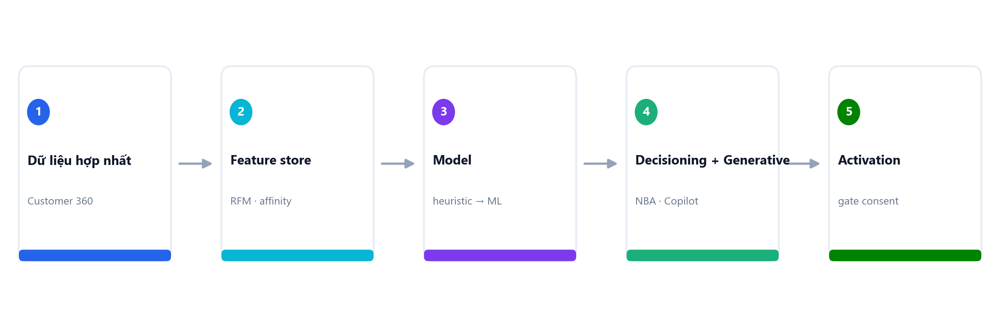
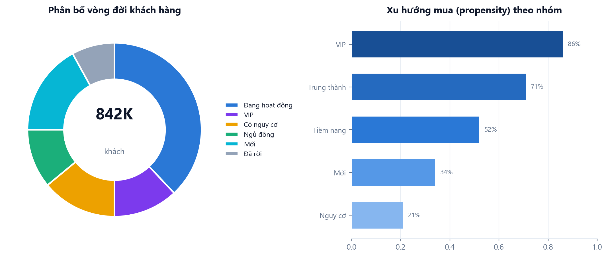

# 3. Tầng AI (Phase A)

Biến **Customer 360** thành công cụ phân tích hành vi + dự báo + quyết định. Phase A chạy ngay bằng **heuristic + SQL + LLM** (không cần Docker), giữ interface để nâng lên **ML (Phase C)** mà không viết lại.

## 3.1. Các chức năng chuyên sâu

| # | Chức năng | Phương pháp (Phase A) | Nơi hiển thị |
|---|-----------|----------------------|--------------|
| 1 | Phân tích hành vi (RFM, lifecycle, affinity) | `feature` + `scoring` heuristic | Customer 360 · Phân tích |
| 2 | Dự đoán sản phẩm sẽ mua (Next-Best-Product) | `recommendV2` cross-brand + market-basket | Customer 360 · Audiences |
| 3 | Dự báo doanh số / nhu cầu | `forecast` moving-average + trend | Phân tích · Control Tower |
| 4 | Propensity-to-buy / Churn / (LTV) | `scoring` (0..1, reasons) | trait → segment |
| 5 | Lifecycle staging | new/active/at_risk/vip/dormant/churned | Customer 360 · segment |
| 6 | Next-Best-Action / Decisioning | rule + score + **consent gate** | Journey · Customer 360 |
| 7 | Cross-brand synergy | SQL `distinct_brands ≥ 2` | Phân tích |
| 8 | Generative Copilot | LLM gateway | Trợ lý AI · Customer 360 |
| 9 | Explainability | reasons[] (→ SHAP ở Phase C) | Customer 360 · Trợ lý AI |

## 3.2. Customer feature (nền phân tích)

Bảng `cdp.customer_feature` (point-in-time) tính từ giao dịch + loyalty + crosswalk:
`recency_days · frequency · monetary · avg_basket · distinct_brands · distinct_categories · favorite_category · loyalty_available · lifecycle_stage · propensity_score · churn_risk · feature_version`.

- `recomputeFeature(occId)` — on-demand (dùng khi mở Customer 360, chạy NBA).
- `recomputeAllFeatures()` — batch (endpoint admin `POST /v1/ai/features/recompute`).
- `feature_version='v0'` (heuristic) → Phase C ghi đè `'ml-v1'` + SHAP vào reasons.

## 3.3. Scoring (heuristic v0, explainable)

`scoreCustomer(rfm, cfg) → { lifecycleStage, propensityScore, churnRisk, reasons[] }`:
- Lifecycle: `new` (freq≤1) → `churned` (recency≥churnGap) → `vip` (freq≥vipFreq & monetary≥vipMonetary) → `dormant` → `at_risk` → `active`.
- `churnRisk = clamp(recency / churnGapDays, 0, 1)`; `propensity = (1 − churnRisk) × min(freq/vipFreq, 1)`.
- Ngưỡng đọc từ `ai_config.rfm` (không hardcode). `reasons[]` giải thích vì sao.

## 3.4. Recommendation v2 (Next-Best-Product cross-brand)

`recommendV2(occId, cfg.reco)` từ view `v_purchase_enriched` (resolve SKU→product_master→category):
- **Collaborative** (peer co-purchase) + **cross-brand** (gợi sản phẩm brand khác) + **market-basket** (co-occurrence cùng giỏ, support/confidence/lift) + **category affinity boost** + **diversity** (cap per category theo `diversityWeight`) + **boost/bury** rules; loại sản phẩm đã mua.
- Output explainable: `{ productMasterId, name, brandId, category, score, source, reasons[] }`.
- Endpoint `GET /v1/ai/recommendations/v2?occId=` (giữ `/v1/ai/recommendations` v1).

## 3.5. Forecast doanh số (heuristic)

`forecastRevenue({brandId?, granularity, periods, window})` — gom doanh thu theo tuần/tháng từ `canonical_transaction`, **moving-average + linear-trend** dự báo N kỳ. Endpoint `GET /v1/analytics/forecast`. Phase C: thay bằng time-series ML (Prophet/GBDT), giữ signature.

## 3.6. Decisioning — Next-Best-Action

`decideNBA(occId, cfg)` = đọc feature (lifecycle) → business rules → **CONSENT GATE** (`isAllowed`, deny-by-default; denied → fallback hành động không cần consent) → `{ action, eligible, reasons[], consentChecked }`. VD: `vip` → loyalty_bonus; `at_risk` → offer email nếu có consent, ngược lại thưởng điểm. Endpoint `POST /v1/ai/nba`.

## 3.7. Segment mở rộng (feed AI → activation)

`SegmentCriteria` thêm (tương thích ngược): `maxRecencyDays · lifecycleStage · loyaltyMin · categoryAffinity · consentPurpose` (JOIN `customer_feature` + consent latest-wins). Kết quả feed activation (vốn gate consent).

## 3.8. LLM Gateway + Generative

- **Gateway provider-agnostic** (`llm.gateway`): mặc định **Anthropic Claude**, + OpenAI + Gemini. Chọn provider+model **theo từng tác vụ** qua `ai_config.llm.tasks`. API key qua ENV (`ANTHROPIC_API_KEY`…). Mỗi call ghi `ai_llm_usage` (token/cost/principal). Bật/tắt qua `features.assistant` (tắt → `LLM_DISABLED`).
- ⚠️ **Guardrail PII:** chỉ gửi dữ liệu **phi-PII / tổng hợp** vào prompt (số liệu, lifecycle/score, category — không tên/sđt/email).
- **4 tính năng** (`POST /v1/ai/assistant/*`, RBAC marketer/analyst):
  1. `ask` — NLQ tiếng Việt trên số liệu tổng hợp.
  2. `segment` — NL → `SegmentCriteria` (validate) → preview.
  3. `content` — sinh nội dung marketing theo brand voice.
  4. `explain` — diễn giải điểm số/insight thành lời.

## 3.9. AI Governance (Admin-only)

Workspace **"AI & Governance"** + bảng `ai_config` (section: `rfm · reco · forecast · decisioning · features · llm`) — **enforcement server-side** (mọi service đọc `getConfig`, không nhận tham số từ client). `ai_config_audit` **append-only** (trigger DB chặn UPDATE/DELETE) ghi "ai đổi gì khi nào". `ai_llm_usage` theo dõi token/cost.

Endpoints (admin): `GET/POST /v1/ai/config`, `GET /v1/ai/config/audit`, `GET /v1/ai/config/usage`.

## 3.10. Analytics chuyên sâu

`GET /v1/analytics/insights` (PG-only) — phân bố lifecycle, doanh thu theo brand, nhóm hàng phổ biến, **synergy cross-brand** (KH ≥2 thương hiệu), churn-risk trung bình. Hiển thị ở workspace **"Phân tích chuyên sâu"**.

## 3.11. Lộ trình

| Phase | Trạng thái | Nội dung |
|-------|-----------|----------|
| **A** | ĐÃ CÓ | Heuristic + SQL + LLM; feature/scoring/reco v2/forecast/decisioning/generative/governance. Không cần Docker. |
| **B** | Kế tiếp | ClickHouse materialized views (offline feature store) + Redis online serving (<50ms); co-visitation precompute. Giữ interface Phase A. |
| **C** | Sau | `ai-service` Python/FastAPI: ML churn/LTV/propensity (GBDT) + demand forecasting + SHAP + model registry, champion/challenger. Ghi đè cùng `customer_feature`. |
